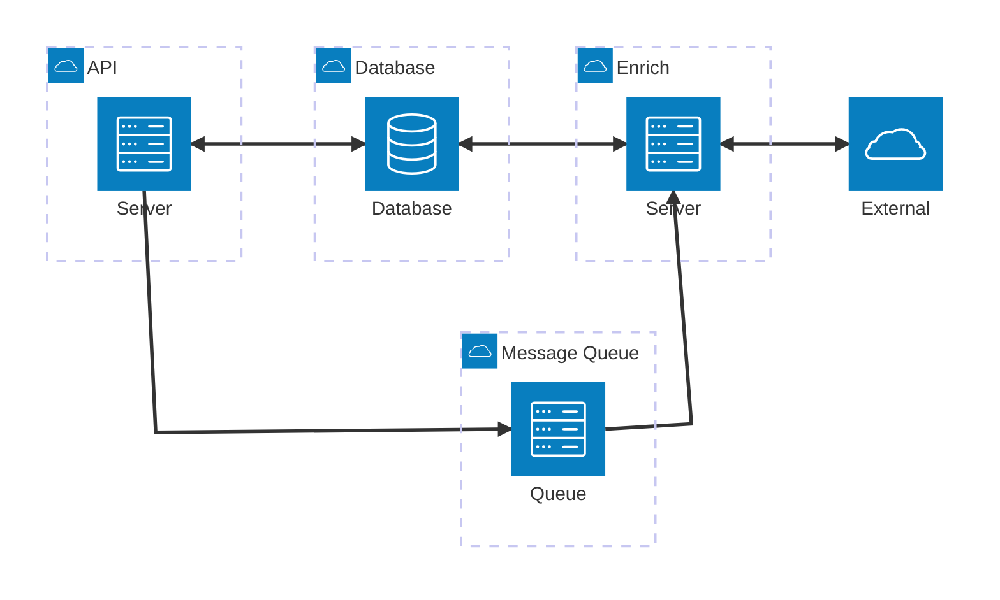

## Overview
An application for managing record collection information while leveraging external sources for data enrichment.

## Components

### API
A REST API for managing a record collection. This API will have CRUD endpoints supporting artists, record labels, and individual collection items.

This is implemented in Python using FastAPI.

### Enrichment Microservice
When creating (and likely editing) entities, external resources can be referenced. To start, a Discogs identifier can be provided for the appropriate entity. When the API handles creation, it will put a message on queue. The enrichment service will read the queue, make external API calls to retrieve data, and persist pertinent information.

This is implemented in Node.js with NestJS.

### Database
Database for persisting core entities--artists, labels, collection items--and supplementary data from external sources.

This is implemented using PostgreSQL.

### Message Queue
Message broker handling data flow from the API to the enrichment microservice.

This is implemented with RabbitMQ using topic exchanges and queues.

#### Message Structure
Messages published to the queue will include:
* **Routing Key**: `artist.created` (or appropriate for action)
* **Metadata**: type (matching routing key), message ID, correlation ID, timestamp
* **Body**: Minimal JSON typically containing the entity identifier, e.g. `{"artistId": "...uuid..."}`

## Architecture Diagram

## Data Flow
Currently, the full data flow is only implemented for artist creation, but the flow should be identical for artist updates, as well as for the other core entities.

* Entity is created or updated with some `integrations` provided in the payload. Currently, only `discogs_id` is supported for Discogs integration.
* API persists entity to the database, and, if any `integrations` are specified, a message is put on a queue, typically containing the identifier of the core entity.
* Enrichment reads the message from the queue.
* Enrichment looks up core entity and checks if any `integrations` are present.
* For any integrations, enrichment performs an API call and persists the desired information.

## Current Limitations

- Only artist creation has complete API + enrichment flow
- Single external source (Discogs) supported
- No authentication/authorization (local development only)
- No error recovery strategy for failed enrichment calls

See [ROADMAP.md](ROADMAP.md) for planned work before production deployment.